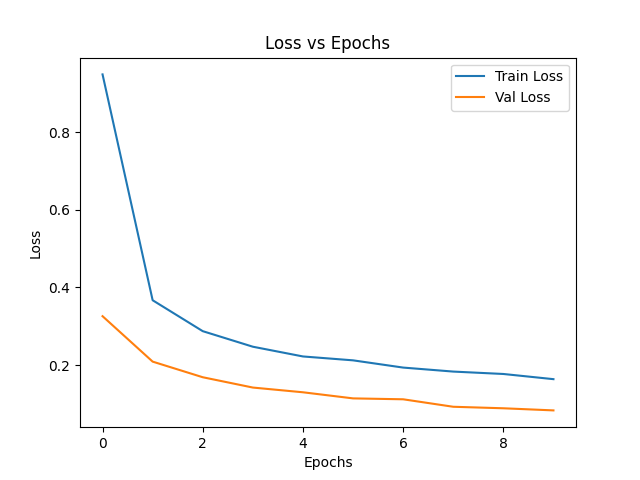
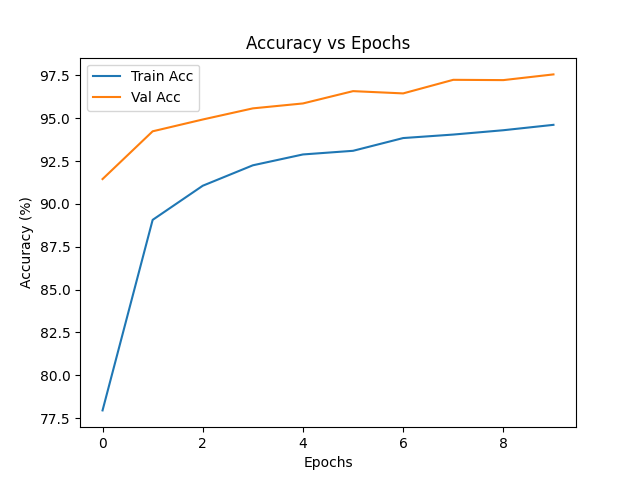

# ✋ ASL Sign Language Recognition
**Live Demo:** [Streamlit App](https://asl-hand-gesture-classification-mphwf9nopdpth9ohadgsqo.streamlit.app/)


This project is a **deep learning-based American Sign Language (ASL) recognition system** built with **PyTorch** and **Streamlit**. It allows users to upload images or capture photos via webcam to recognize ASL letters (A–Z) along with **special signs**: `SPACE`, `DELETE`, and `NOTHING`.

---

## 🚀 Features

* 📤 Upload images (`.jpg`, `.jpeg`, `.png`) for prediction
* 📸 Take a photo directly from the webcam
* ⚡ Real-time prediction with a trained **EfficientNet-B3** model
* 🎨 Clean and interactive UI built with **Streamlit**
* 🛡️ Robust preprocessing and data augmentation for real-world images

---

## 📊 Model Details

* **Architecture**: **EfficientNet-B3**
* **Training Data**: ASL alphabet dataset (A–Z + SPACE, DELETE, NOTHING)
* **Validation Accuracy**: **97.56%**
* **Test Accuracy**: **97.56%**

> ⚠️ Data augmentation was applied during training to improve generalization to real-world images, including Google images and webcam inputs.

---

## 🧑‍💻 Data Augmentation (Training)

```python
train_transform = transforms.Compose([
    transforms.Resize((224,224)),
    transforms.RandomHorizontalFlip(),
    transforms.RandomRotation(10),
    transforms.ToTensor(),
    transforms.Normalize(mean, std)  # mean=[0.485,0.456,0.406], std=[0.229,0.224,0.225]
])
```

---

## 🏋️‍♂️ Training Results (10 Epochs)

| Epoch | Train Loss | Train Acc | Val Loss | Val Acc |
| ----- | ---------- | --------- | -------- | ------- |
| 1     | 0.9490     | 77.95%    | 0.3259   | 91.45%  |
| 2     | 0.3670     | 89.07%    | 0.2088   | 94.24%  |
| 3     | 0.2873     | 91.06%    | 0.1685   | 94.93%  |
| 4     | 0.2472     | 92.26%    | 0.1419   | 95.58%  |
| 5     | 0.2221     | 92.89%    | 0.1298   | 95.87%  |
| 6     | 0.2121     | 93.10%    | 0.1140   | 96.59%  |
| 7     | 0.1934     | 93.85%    | 0.1117   | 96.45%  |
| 8     | 0.1831     | 94.05%    | 0.0924   | 97.25%  |
| 9     | 0.1769     | 94.30%    | 0.0885   | 97.23%  |
| 10    | 0.1636     | 94.62%    | 0.0831   | 97.56%  |

### 📈 Loss & Accuracy Plots




### ⚡ Evaluation Metrics

* **Test Accuracy**: 97.56%
* **Precision**: 0.9759
* **Recall**: 0.9756
* **F1 Score**: 0.9757

---

## 🛠️ Tech Stack

* **Python 3.x**
* **PyTorch** – deep learning model training & inference
* **Torchvision** – image transformations
* **Streamlit** – interactive web app
* **PIL (Pillow)** – image processing

---

## 📂 Project Structure

```
ASL-Sign-Recognition/
│── README.md              # Project documentation
│── requirements.txt       # Python dependencies
│── deployment/
│   └── app.py             # Streamlit application
│── models/
│   └── model.py           # EfficientNet-B3 architecture & loading
│── results/
│   ├── loss_curve.png           # Training loss plot
│   └── accuracy_curve.png       # Training accuracy plot
│── notebooks/
    └── Asl_hand_gesture_classification.py        # Any Jupyter notebooks
```

---

## ▶️ Run Locally

### 1️⃣ Clone the repository

```bash
git clone https://github.com/huzaifa12466/Asl-hand-gesture-classification.git
```

### 2️⃣ Install dependencies

```bash
pip install -r requirements.txt
```

### 3️⃣ Run the app

```bash
streamlit run app.py
```

Access the app at: 👉 `http://localhost:8501`

---

## 🌍 Deployment

You can deploy on:

* **Streamlit Cloud** (recommended)
* **Hugging Face Spaces**
* **Heroku / Render** (custom deployments)

---

## 🎯 Example Predictions

* Upload an ASL letter image or use webcam
* ✅ Example: `Prediction: A`

---

## 📌 Future Improvements

* Extend to **dynamic signs** (words/phrases)
* Add **real-time video recognition**
* Improve dataset with **more diverse samples**

---

## 🙌 Acknowledgments

* Dataset: ASL Alphabet Dataset
* Frameworks: PyTorch, Streamlit

---

💡 **Author:** Built with ❤️ by \[Muhammad Huzaifa]
📧 Contact: [qhuzaifa675@gmail.com](mailto:qhuzaifa675@gmail.com)
